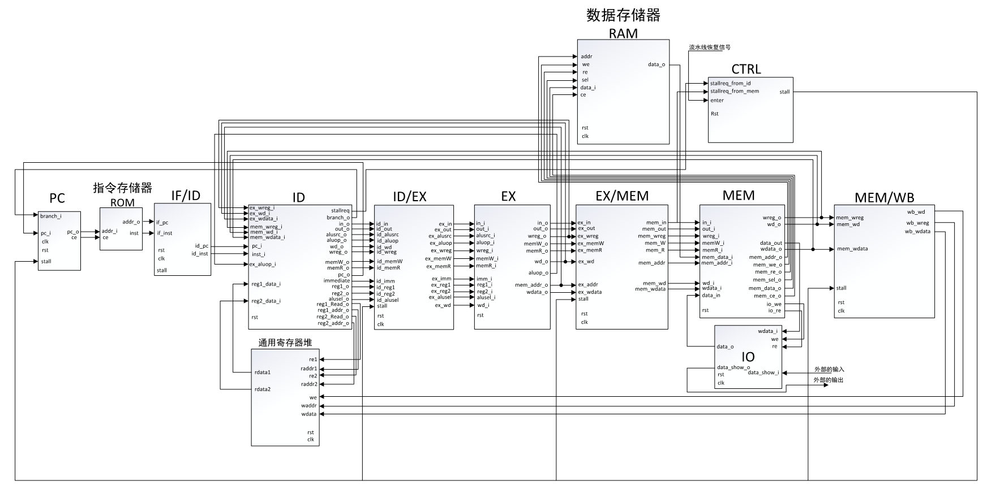
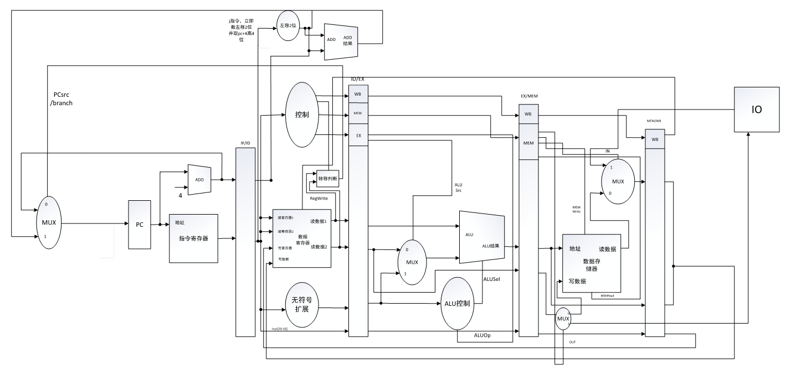

## 前言

&emsp;&emsp;实现了一个 32 位的五级流水 RISC 指令集的 CPU。一共设计了 9 条指令以及 IN、OUT 指令，IO 模块实现**人机交互**，并可以**停顿流水线**运作（通过D锁存器保存状态，同时解决**数据依赖**问题），拨动开关可以恢复运作流水线。

&emsp;&emsp;觉得此项目不错的小伙伴，记得 **star**~。

---

## 实现的指令集

- LW，数据加载
- SW，数据存储
- ADD，加法
- SUB，减法
- AND，逻辑与
- OR，逻辑或
- SLT，条件置位
- BEQ，相等则跳转
- J，无条件跳转
- IN，外界输入（采用LED数码管显示）
- OUT，外界输出（采用LED数码管显示）

---

## 系统结构图

---

## 五级流水结构图

---

## 总结

&emsp;&emsp;刚开始对 verilog 语言进行熟悉，了解组合电路与时序电路的不同，以及思考每个模块应该是什么电路。在设计时，遇到了许多的麻烦，通过一步步地排查，最终得到想要的结论。在平时学习时，对于流水级的执行过程不是非常理解，但是通过本次项目，加深了理解，并有了一些自己的改进，**实践是检验真理的唯一标准**。

---

## 参考文献

1. 《自己动手写CPU》
2.  计算机组成与设计：硬件/软件接口（原书第 5 版）